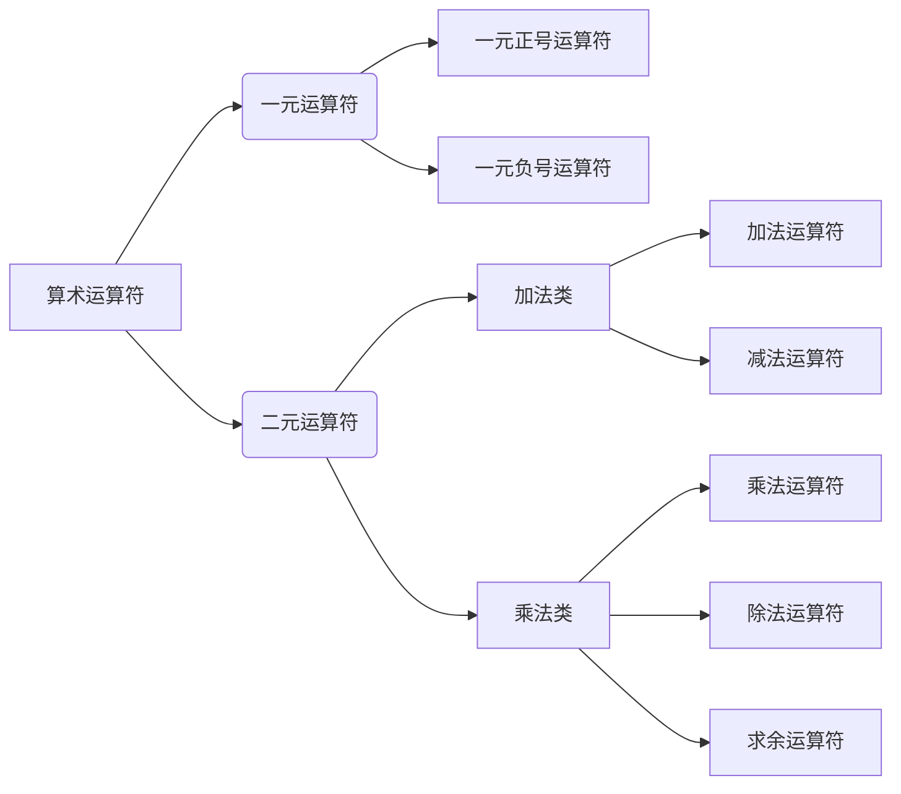

- [ ] # **C语言,翻墙学习笔记**

## *翻墙*

- [翻墙购买网址](https://yes.xn--mesv7f5toqlp.biz/register?code=vhLIBBOb)

- 成果展示

  

  


## C语言学习

- ``` C语言
  #include "stdio.h"
  
  int a,b,c;
  
  int main()
  {
  	a=b+c;  //语句
  	
  	return 0;
  }
  ```

### 算术运算符



### 语法

1. 正号与负号

   1. +2：正号，什么也不做（通常省略不写）
   2. -3：负号，用来取相反数
2. 除法运算 /
   1. 整数除法：结果依然是整数，向 0 取整。
   2.  浮点数除法：结果是浮点数。
3. 求余运算 %
   1. 结果的正负取决于被除数（左边的数），向无穷取整。
   2. 注意：% 两边必须是整数，不能是小数。

### 运算符的优先级和结合性

- 括号优先级最高，搞不清就直接加括号 `()`。
- `a + b * c` 等价于 `a + (b * c)`，乘法优先于加法。

###  赋值运算符

> 核心规则：把等号右边的值，赋给左边的变量。

- 左值：只能放在等号左边的变量。

- 常见错误：
  - `12 = i;`  ❌

  - `i + j = 2;` ❌

  - 括号优先级最高，搞不清就直接加括号 `()`。

  - `a + b * c` 等价于 `a + (b * c)`，乘法优先于加法。

    > 核心规则：把等号右边的值，赋给左边的变量。

    - 左值：只能放在等号左边的变量。
    - 常见错误：
      - `12 = i;`  ❌
      - `i + j = 2;` ❌
      - `-i = j;` ❌


~~~ c
#include "stdio.h"

int a=2;
int b=3;
int c=4;

int main()
{
    a=a+1;
    a++;

    printf("a=%d",a);

    return 0;
}
~~~

~~~ c
#include <stdio.h>

int main()
{
    int a = 2;
    int b = 3;
    int c = 4;

    a = b - 2;

    printf("a=%d\nb=%d", a, b);

    return 0;
}
~~~

~~~ c
#include "stdio.h"
int a=2;
int b=3;
int c=4;
int main()
{
    a=b!=c;
    printf("a=%d",a);
    return 0;
}
~~~

~~~ c
#include "stdio.h"
int a=2;
int b=3;
int c=4;
int main()
{
    a = (b<c) && (c==5);
    printf("a=%d",a);
    return 0;
}
~~~


~~~ c
#include "stdio.h"

int num;

int main()
{
    printf("请输入一个数：");
    scanf("%d",&num);

    if(num%2==0)
        printf("这是一个偶数");
    else
        printf("这是一个奇数");

    return 0;
}
~~~


~~~ c
#include "stdio.h"

int num;

int main()
{
    printf("请输入一个数：");
    scanf("%d", &num);

    if(num % 2 == 0)
    {
        num = num * 5;
        printf("这是一个偶数");
    }
    else
    {
        num = num * 3;
        printf("这是一个奇数");
    }

    return 0;
}
~~~


~~~ c
#include "stdio.h"

int num;

int main()
{
    printf("请输入你的成绩：");
    scanf("%d", &num);

    if(num == 0)
    {
        printf("您的成绩不及格");
    }
    else if(num == 1)
    {
        printf("您的成绩不及格");
    }
    else if(num == 2)
    {
        printf("您的成绩不及格");
    }
    else if(num == 3)
    {
        printf("您的成绩不及格");
    }
    else if(num == 4)
    {
        printf("您的成绩不及格");
    }
    else if(num == 5)
    {
        printf("您的成绩不及格");
    }
    else if(num == 6)
    {
        printf("您的成绩及格");
    }
    else if(num == 7)
    {
        printf("您的成绩优秀");
    }
    else if(num == 8)
    {
        printf("您的成绩优秀");
    }
    else if(num == 9)
    {
        printf("您的成绩优秀");
    }
    else if(num == 10)
    {
        printf("您的成绩满分");
    }
    else
    {
        printf("您的成绩输入有误");
    }

    return 0;
}
~~~


~~~ c
#include "stdio.h"

int num;

int main()
{
    printf("请输入你的成绩：");
    scanf("%d", &num);

    switch(num)
    {
        case 0:
            printf("您的成绩不合格");
        case 1:
            printf("您的成绩不合格");
        case 2:
            printf("您的成绩不合格");
        case 3:
            printf("您的成绩不合格");
        case 4:
            printf("您的成绩不合格");
        case 5:
            printf("您的成绩不合格");
        case 6:
            printf("您的成绩合格");
        case 7:
            printf("您的成绩优秀");
        case 8:
            printf("您的成绩优秀");
        case 9:
            printf("您的成绩优秀");
        case 10:
            printf("您的成绩优秀");
        default:
            printf("您的成绩输入有误");
    }

    return 0;
}
~~~


